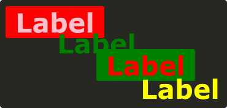

# Label

Labels can be used for placing text on-screen. 


```csharp
label bounds(x, y, width, height), text("text"), colour("colour"), channel("chan") \
fontcolour("colour"), align("position"), identchannel("channel"), \
alpha(val), visible(val), rotate(radians, pivotx, pivoty), corners(val)\
widgetarray("chan", number), active(val), fontstyle("style")
```
<!--(End of syntax)/-->

##Identifiers

### Specific Identifiers





**fontstyle("style")** Sets the style of the font. Valid styles are, "plain", "bold"(default), "bold italic", "italic", "underlined", "bold underlined", "italic underlined" and "bold italic underlined". 

**text("text")** "text" will be the string to appear on the label

### Common Identifiers

 

 

 

 

 

 

 

 

 
 
 

<!--(End of identifiers)/-->

##Example
```csharp
<Cabbage>
form size(400, 500), caption("Untitled"), pluginID("plu1"), colour(39, 40, 34)
label bounds(14, 10, 161, 52), text("Label"), colour("red"), fontcolour("pink")
label bounds(82, 44, 161, 52), text("Label"), colour(255, 255, 0, 0), fontcolour("green")
label bounds(162, 80, 161, 52), text("Label"), colour("green"), fontcolour("red")
label bounds(218, 118, 161, 52), text("Label"), colour(120, 40, 20, 0), fontcolour("yellow")
</Cabbage>
```

