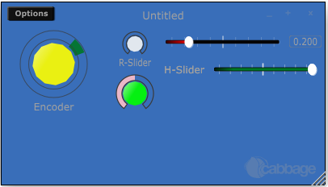

# Endless encoder

Encoder creates an endless rotary encoder similar to those found in certain well-known hardware samplers. Unlike regular sliders, *encoder* doesn't have a start and stop point. One may set a starting point, but after this the user can drag up or down as long as they like. By setting a very small slider increment these widgets can offer a level of fine grain control not possible with regular sliders. 

```csharp
encoder bounds(x, y, width, height), channel("chan"), min(val), max(val)\
text("name"), textbox(val), value(val), increment(val), textcolour("colour"), fontcolour("colour"), \
trackercolour("colour"), outlinecolour("colour"), identchannel("channel"), alpha(val), \
visible(val), caption("caption"), rotate(radians, pivotx, pivoty),\
widgetarray("chan", number), popuptext("text") active(val)
```
<!--(End of syntax)/-->

##Identifiers
**bounds(x, y, width, height)** integer values that set position and size on screen(in pixels). 

**channel("chan")** "chan" is the name of the channel that Cabbage will communicate with Csound on. The current value of this widget can be retrieved in Csound using a chnget opcode, or can be set using a chnset opcode. If you are using a hslider2 or vslider2 widget you will need to pass two channel names, e.g., channel("sliderMin", "slidermax"), as the slider will be sending data over two channels. 

**value(val)** Used to set the initial value of the encoder.

**increment(val)** Set the incremental step size for the encoder.

**max(val)** Sets the maximum value of the encoder. If left out, there is no maximum limit. 

**min(val)** Sets the minimum value of the encoder. If left out, there is no minimum limit. 

**text("name")** The string passed in for "name" will appear on a label beside the slider. This is useful for naming sliders.   

**textbox(on/off)** textbox takes a 0 or a 1. 1 will cause a text box to appear with the sliders values. Leaving this out will result in the numbers appearing automatically when you hover over the sliders with your mouse.

**colour("colour")** This sets the slider. Any CSS or HTML colour string can be passed to this identifier. The colour identifier can also be passed an RBG, or RGBA value. All channel values must be between 0 and 255. For instance colour(0, 0, 255) will create a blue, while colour(0, 255, 0, 255) will create a green with an alpha channel set to full. 

**textcolour("colour")** This set the colour of the text passed to text(). If you wish to change the colour of the numbers being displayed use fontcolour(). See below. See above for details on valid colours. 

**fontcolour("colour")** Sets the colour of the text used to display the slider's value when textbox is enable. See above for details on valid colours. .

**trackercolour("colour")** Sets the colour of the slider**s tracker. This is the line that follows the slider when you move it. See above for details on valid colours. 

**outlinecolour("colour")** Sets the colour of a rotary slider**s tracker outline. This is the line that is drawn around the rslider's tracker. If you don't wish to display the tracker outline set the colour to something with an alpha value of 0. See above for details on valid colours.  

**identchannel("channel")** Sets the channel which messages from Csound are sent to the widget on. When used with a chnset opcode users can override widget attributes. See [Identifier channels](./identchannels.md) 

**alpha(val)** A value between 0 and 1 will set the alpha blend value for the entire component. Can be useful if you need to fade widgets in and out. 

**visible(val)** A value of 0 will cause the widget to become invisible. Widgets have their visibility set to 1 by default. 

**caption("caption")** This identifier will place the widget within a groupbox. "caption" is the text that will appear on group box. This identifier is included for legacy purposes only. It is recommended that you use use your own groupbox component as it will give you far more control over how everything appears on your instrument. 

**rotate(radians, pivotx, pivoty)** Rotates the widget by a number of radians(2xPI=full rotation). pivotx and pivoty will determine the rotation pivot points, where 0, 0 represents the component's top-left position. 

**widgetarray("chan", number)** Creates an number of widgets in a single pass. See [Widget arrays](./widget_arrays.md)

**popuptext("text")** Sets the text that will appear in the popup text bubble when a user hovers over the widget. This can be used to override the defaul text which displays the channel name and the current value. 

**active(val)** Will deactivate a control if 0 is passed. Controls which are deactivate can still be updated from Csound.

<!--(End of identifiers)/-->

##Example
```csharp
<Cabbage>
form size(400, 200), caption("Untitled"), pluginID("plu1"), colour(57, 110, 185)
encoder bounds(12, 8, 105, 105), channel("vslider1"), value(100), sliderincr(0.01), text("Encoder"), colour("yellow")
rslider bounds(140, 8, 50, 50), text("R-Slider"), channel("rslider1"), range(0, 1, 0)
rslider bounds(140, 62, 50, 50), channel("rslider2"), range(0, 1, .5), colour("lime"), trackercolour("pink")
hslider bounds(196, 8, 200, 30), channel("hslider1"), range(0, 1, .2), trackercolour("red"), textbox(1)
hslider bounds(196, 42, 200, 30), text("H-Slider"), channel("hslider2"), range(0, 1, 1)
hslider bounds(196, 42, 200, 30), text("H-Slider"), channel("hslider2"), range(0, 1, 1)
</Cabbage>
```

