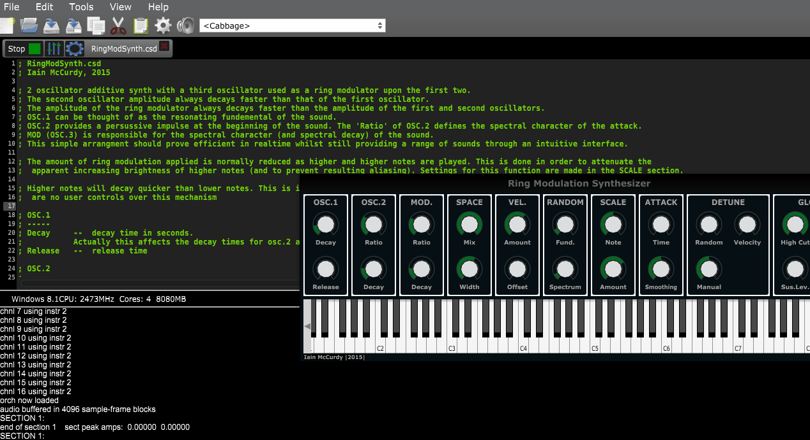

# Exporting your instruments as audio plugins

Cabbage gives users the option of exporting instruments for use in other VST host software such as Reaper, Ardour, Live, etc. Once you have created your instruments you will need to export them as plugins from the 'File' menu in the Cabbage IDE. When you export an instrument Cabbage will create a plugin binary with a .so, .vst, or .dll file extension, depending on your OS. Cabbage will also make a copy of your current text file and place it into the same directory as the plugin file. The newly created text file and plugin file will have the same file name (with different file extensions). 

It's important that you keep these files together. Failing to do so will cause problems as the Cabbage plugin will not be able to find the corresponding Csound text file. Once you have your plugin created, you will need to add the plugin directory to your host. On Linux you can simply make sure that all plugins reside in ~/.vst. Most hosts in OSX and Windows let you specify unique plugin directories. The best strategy here is to keep all your Cabbage plugins in the same directory. That way you only need to set the plugin directory once. For more details on setting plugin directories consult the documentation for your host software. 

>In order to make changes to your newly exported plugin you only need to edit the associated .csd file. You don't need to keep exporting the plugin each time. For instance, on Windows you might have a plugin called "SavageCabbage.dll". If you wish to make some changes to this plugin you only have to edit the corresponding "SavageCabbage.csd" file. In order to see the changes in your plugin host you will need to delete and reinstate the plugin from the track. Once you remove and add the plugin it will show the new changes. 