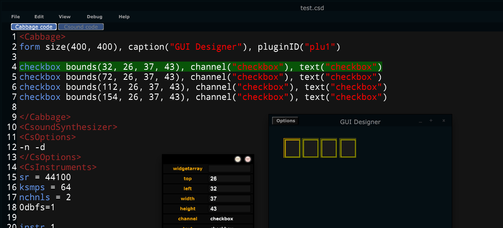

# The GUI Designer
Users can enable the GUI designer by turning on "Edit-mode" in the *Options* menu. With edit mode enabled new widgets can be inserted by right-clicking on the instrument's main form and choosing the relevant widget to insert. Widgets are grouped into two categories.

**Indigenous** These are all the standard Cabbage widgets such as rsliders, buttons, etc..

**Homegrown** These are any widgets that you have added to the repository. 

Once a widget has been placed onto the form, an identifier properties dialogue window will open. Identifiers can be modified by clicking on the appropriate property box. Hitting the *Escape* or *Esc* key on the keyboard will update the widget and update the Cabbage code. Clicking on a widget will also highlight the current widget's Cabbage code.    

Multiple widgets can be selected by dragging over them. Once selected they can be moved around the screen and duplicated, but they can't be resized in a single move. To do this one must group the widgets into [Plants](./plants.md). Once the widgets have been grouped as a plant, they can be resized by dragging the corner of the plant. The newly created plant can also be added to the Plant repository by right-clicking and selecting the 'Add to Repository' command. 

Note that the GUI designer is there for quickly developing and prototyping GUIs. While it can save some time in the early stages of development, for complex GUIs it is recommended to hard code the widget's attributes.  
