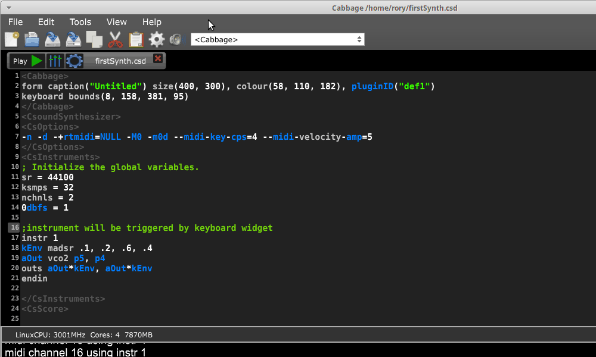
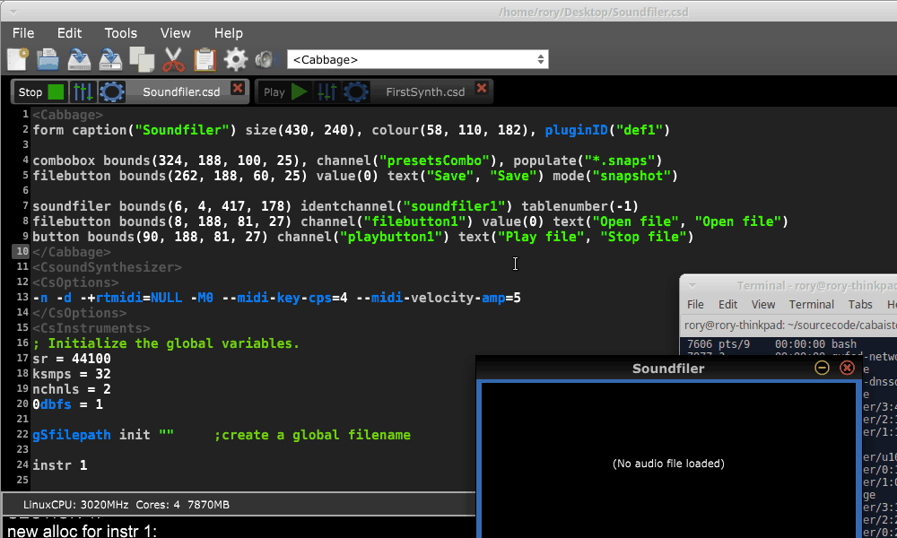

# Using Cabbage

Instrument development and prototyping is carried out with the main Cabbage IDE. Users write and compile their Csound code in a code editor. Each Csound file opened with have a corresponding editor. If one wishes one can also create a graphical frontend, although this is no longer a requirement for Cabbage. Any Csound file can be run with Cabbage, regardless of whether or not it has a graphical interface. Each Csound files that is compiled by Cabbage will be added to an underlying digital audio graph. Through this graph users can manage and configure instrument to create patches of complex processing chains. 

[Opening Files](#OpeningFiles)

[Creating new files](#NewFiles) 

[Building/compiling instruments](#Building) 

[Creating GUI interfaces for instruments](#CreatingGUIs) 

[Editing the audio graph](#AudioGraph) 

[Navigating large source files](#Navigating) 

[Using the code repository](#CodeRepo) 

##Opening files
User can open any .csd files by clicking on the Open File menu command, or toolbar button. Users can also browse the Examples menu from the main File menu. Cabbage ships with over 100 high-end instruments that can be modified, hacked, and adapted in any way you wish. Note that if you wish to modify the examples, use the Save-as option first. Although this is only required on Windows, it's a good habit to form. You don't want to constantly overwrite the examples with your own code. 
>Cabbage can load and perform non-Cabbage score-driven .csd files. However, it also uses its own audio IO, so it will overwrite any -odac options set in the CsOptions section of a .csd file. 

##Creating a new file
News files can be created by clicking the New file button in the toolbar, or by clicking File->New Csound file from the main menu. When a new file is requested, Cabbage will give you the choice of 3 basic templates, as shown below. 

The choices are:
- A new synth. When this option is selected Cabbage will generate a simple synthesiser with an ADSR envelope and MIDI keyboard widget. In the world of VST, these instruments are referred to a VSTi's. 
- A new effect. When this option is selected Cabbage will create a simple audio effect. It will generate a simple Csound instrument that provides access to an incoming audio stream. It also generates code that will control the gain of the output.  
- A new Csound file. This will generate a basic Csound file without any graphical frontend. 

>Note that these templates are provided for quickly creating new instruments. One can modify any of the template code to convert it from a synth to an effect or vice versa. 

##Building/compiling instruments
To run an instrument users can use the controls at the top of the file's editor. Alternatively one can go to the Tools menu and hit Build Instrument. 

>Closing a file will not stop it from performing. To stop a file from performing you must hit the Stop button.  

##Creating GUI interfaces for instruments
To create a GUI for your instrument you must enter edit mode for that instrument. you can do this by hitting the Edit mode button at the top of the file's editor, or by hitting Ctrl+e when the editor for that instrument have focus. Once in edit mode, each widget will have a thin white border around it. you can move widgets around whilst in edit. You can also right-click and insert new widgets, as well as modify their appearance using the GUI properties editor on the right-hand side of the screen. 

You will notice that when you select a widget whilst in edit mode, Cabbage will highlight the corresponding line of text in your source code. When updating GUI properties, hit 'Enter' when you are editing single line text or numeric properties, 'Tab' when you are editing multi-line text properties, and 'Escape' when you are editing colours. 

##Editing the audio graph
Each and every instrument that you compile in Cabbage will be added to an underlying audio graph. This is true for both Cabbage files, and traditional Csound files. To edit the graph one can launch the Cabbage patcher from the view menu. 

Instruments can also be added directly through the graph by right-clicking and adding them from the context menu. The context menu will show all the examples files, along with a selection of files from a user-defined folder. See the section below on *Settings* to learn how to set this folder. 

Instruments can also be deleted by right-clicking the instrument node. Users can deleted/modify connections by clicking on the connections themselves. They can also connect node by clicking and dragging from an output to an input.
 
Once an instrument node has been added, Cabbage will automatically open the corresponding code. Each time you update the corresponding source code, the node will also be updated. 
>As mentioned above, closing a file will not stop it from performing. It is possible to have many instruments running even though their code is not showing. To stop an instrument you must hit the Stop button at the top of its editor, or delete the plugin from the graph.

##Navigating large source files
It can become quite tricky to navigate very long text files. For this reason Cabbage provides a means of quickly jumping to instrument definitions. It is also possible to create a special `;- Region:` tag. Any text that appears after this tag will be appended to the drop-down combo box in the Cabbage tool bar.
 

##Using the code repository
Cabbage provides a quick way of saving and recalling blocks of code. To save code to the repository simple select the code you want, right-click and hit 'Add to code repository'. To insert code later from the repository, right-click the place you wish to insert the code and hit 'Add from code repository'.

Code can be modified, edited or deleted at a later stage in the Settings dialogue. 
