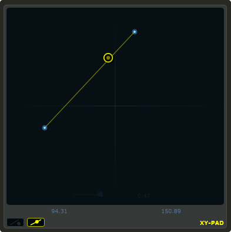

# XY Pad

xypad is an x/y controller that sends data to Csound on two named channels. The first channel transmits the current position of the ball on the X axis, while the second transmits the position of the ball on the Y axis. The XY pad can function in two unique modes of automation, free and path based. The two modes can be toggled by clicking on the corresponding icon on the bottom left of the xypad control. With either mode selected you can right-click the xypad and create a trajectory or path for the circle's movement. Release the mouse and the circle will start moving. Once the ball is in full flight you can control the speed of the ball using the XY pad slider that will appear once you hover over it with the mouse. To stop the ball simple left click anywhere on the xy pad canvas with the left mouse button. 


```csharp
xypad bounds(x, y, width, height), channel("chan1", "chan2"), \
rangex(min, max, val), rangey(min, max, val), text("name"), \
identchannel("channel"), colour("colour"), fontcolour("colour"), \
textcolour("colour"), alpha(val), visible(val), widgetarray("chan", number) \
active(val)
```
<!--(End of syntax)/-->

##Identifiers

**bounds(x, y, width, height)** integer values that set position and size on screen(in pixels)

**channel("chan1", "chan2")** "chan1" is the name of the X-axis channel in which to communicate with Csound, and "chan2" is the Y-axis channel in which to communicate with Csound.

**text("name")** "name" will be the text that appears on the top right hand side of the XYpad surface.  

**rangex(min, max, value)** sets the range of the X axis. The first 2 parameters are required. The third is optional. The first two parameters let you set the minimum value and the maximum value. The next parameter determines the initial value. 

**rangey(min, max, value)** sets the range of the Y axis. The first 2 parameters are required. The third is optional. The first two parameters let you set the minimum value and the maximum value. The next parameter determines the initial value. 

**colour("colour")** This sets the colour of the xypad circle and corresponding number boxes. Any CSS or HTML colour string can be passed to this identifier. The colour identifier can also be passed an RBG, or RGBA value. All channel values must be between 0 and 255. For instance colour(0, 0, 255) will create a blue, while colour(0, 255, 0, 255) will create a green with an alpha channel set to full.  

**fontcolour("colour")** This sets the colour of the xypad values. See above for details on valid colours.

**textcolour("colour")** Sets the colour of the text passed to text(), and also sets the colour of the mode selector.

**identchannel("channel")** Sets the channel which messages from Csound are sent to the widget on. When used with a chnset opcode users can override widget attributes. See [Identifier channels](./identchannels.md) 

**alpha(val)** A value between 0 and 1 will set the alpha blend value for the entire component. Can be useful if you need to fade widgets in and out. 

**visible(val)** A value of 0 will cause the widget to become invisible. Widgets have their visibility set to 1 by default

> XY pads range identifiers do not permit the setting of skew factors, or increments. If you wish to set a custom skew factor, or increment value, you will need to do so using Csound code.  

**widgetarray("chan", number)** Creates an number of widgets in a single pass. See [Widget arrays](./widget_arrays.md) 

**active(val)** Will deactivate a control if 0 is passed. Controls which are deactivate can still be updated from Csound.

<!--(End of identifiers)/-->

##Example:

```csharp
<Cabbage>
form size(400, 500), caption("Untitled"), pluginID("plu1"), colour(39, 40, 34)
xypad bounds(10, 10, 380, 380), channel("x", "y"), colour("yellow"), textcolour("yellow"), text("XY-PAD")
</Cabbage>
```

